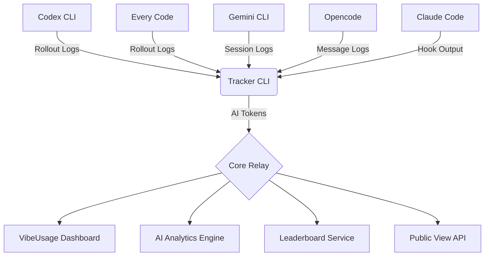

<div align="center">


# 🟢 VIBEUSAGE

**QUANTIFY YOUR AI OUTPUT**  
_Real-time AI Analytics for Codex CLI_

[**www.vibeusage.cc**](https://www.vibeusage.cc)

[](https://opensource.org/licenses/MIT)
[](https://nodejs.org/)
[](https://www.apple.com/macos/)

[**English**](README.md) • [**中文说明**](README.zh-CN.md)

[**Documentation**](docs/) • [**Dashboard**](dashboard/) • [**Backend API**](BACKEND_API.md)

<br/>


</div>

---

## 🌌 Overview

**VibeUsage** is an intelligent token usage tracking system designed specifically for macOS developers. Through the all-new **Matrix-A Design System**, it provides a high-fidelity cyberpunk-style dashboard that transforms your **AI Output** into quantifiable metrics, supported by the **Neural Divergence Map** for real-time monitoring of multi-model compute distribution.

> [!TIP] > **Core Index**: Our signature metric that reflects your flow state by analyzing token consumption rates and patterns.

## 🔒 Privacy-First Architecture (Stealth Protocol)

We believe your code and thoughts are your own. VibeUsage is built with strict privacy pillars to ensure your data never leaves your control.

- 🛡️ **No Content Upload**: We never upload prompts or responses. We only compute token counts locally and send counts plus minimal metadata (timestamps, model, device).
- 📡 **Local Aggregation**: All token consumption analysis happens on your machine. We only relay quantized 30-minute usage buckets to the cloud.
- 🔐 **Hashed Identity**: Device tokens are hashed using SHA-256 server-side. Your raw credentials never exist in our database.
- 🔦 **Full Transparency**: Audit the sync logic yourself in `src/lib/rollout.js`. We literally only capture numbers and timestamps.

## 🚀 Key Features

- 📡 **Auto-Sync**: Real-time interception of AI CLI pipes with **automatic background synchronization**. Once initialized, your tokens are tracked and synced without any manual commands.
- 🧭 **Universal-Sync**: Native support for multiple AI CLI tools:
  - **Codex CLI** - OpenAI's official CLI
  - **Every Code** - Community Codex alternative
  - **Gemini CLI** - Google's AI CLI
  - **Opencode** - AI coding assistant
  - **Claude Code** - Anthropic's official CLI
  - Whether it's GPT-4, Claude 3.5 Sonnet, or o1/Gemini, token consumption from all models is unified and counted.
- 📊 **Matrix Dashboard**: High-performance dashboard built with React + Vite, featuring the new **Matrix-A** design language.
  - **Neural Divergence Map**: Visualize multi-engine load balancing and compute distribution.
  - **Cost Intelligence**: Real-time, multi-dimensional cost breakdown and forecasting.
  - **Activity Heatmap**: GitHub-style contribution graph with streak tracking.
  - **Smart Notifications**: Non-intrusive system-level alerts using a Golden (Gold/Amber) visual style for high-value information.
- ⚡ **AI Analytics**: Deep analysis of Input/Output tokens, with dedicated tracking for Cached and Reasoning components.
- 📈 **Leaderboard**: Daily, weekly, monthly, and all-time rankings with privacy-safe display names.
- 🌐 **Public View**: Share your AI usage journey with a privacy-safe public profile.
- 📁 **Project Stats**: Track token usage by project/repository across all time.
- 🔒 **Identity Core**: Robust authentication and permission management to secure your development data.

### 🌌 Visual Preview


## 🛠️ Quick Start

### Installation

Initialize your environment once and forget it. VibeUsage handles all synchronization in the background automatically.

```bash
npx --yes vibeusage init
```

**Authentication Methods:**

1. **Browser Auth** (default) - Opens browser for secure authentication
2. **Link Code** - Use `--link-code` to authenticate via dashboard-generated code
3. **Password** - Direct password authentication (fallback)
4. **Access Token** - For CI/automated environments

**CLI Options:**
- `--yes` - Skip consent prompts in non-interactive environments
- `--dry-run` - Preview changes without writing files
- `--link-code <code>` - Authenticate using a link code from dashboard
- `--base-url <url>` - Override the default API endpoint

**Supported CLI Tools Auto-Configuration:**

| Tool | Config Location | Method |
|------|----------------|--------|
| Codex CLI | `~/.codex/config.toml` | `notify` hook |
| Every Code | `~/.code/config.toml` (or `CODE_HOME`) | `notify` hook |
| Gemini CLI | `~/.gemini/settings.json` (or `GEMINI_HOME`) | `SessionEnd` hook |
| Opencode | Global plugins | Message parser plugin |
| Claude Code | `~/.claude/hooks/` | Hook configuration |

Once `init` completes, all supported CLI tools are automatically configured for data sync. No further intervention required.

### Sync & Status

While sync happens automatically, you can manually trigger a synchronization or check status anytime:

```bash
# Manually sync latest local session data (Optional)
npx --yes vibeusage sync

# Check current link status
npx --yes vibeusage status
```

### Doctor

```bash
# Run health checks
npx --yes vibeusage doctor

# Emit JSON report (and write to file)
npx --yes vibeusage doctor --json --out doctor.json

# Override base URL (diagnostics only)
npx --yes vibeusage doctor --base-url https://example.invalid
```

### Uninstall

```bash
# Standard uninstall (keeps data)
npx --yes vibeusage uninstall

# Full purge - removes all data including config and cached sessions
npx --yes vibeusage uninstall --purge
```

### Log Sources

| Tool | Log Location | Override Env |
|------|-------------|--------------|
| Codex CLI | `~/.codex/sessions/**/rollout-*.jsonl` | `CODEX_HOME` |
| Every Code | `~/.code/sessions/**/rollout-*.jsonl` | `CODE_HOME` |
| Gemini CLI | `~/.gemini/tmp/**/chats/session-*.json` | `GEMINI_HOME` |
| Opencode | `~/.opencode/messages/*.json` | - |
| Claude Code | Parsed from hook output | - |

## 🔧 Environment Variables

### Core Settings

| Variable | Description | Default |
|----------|-------------|---------|
| `VIBEUSAGE_HTTP_TIMEOUT_MS` | CLI HTTP timeout in ms (`0` disables, clamped `1000..120000`) | `20000` |
| `VITE_VIBEUSAGE_HTTP_TIMEOUT_MS` | Dashboard request timeout in ms (`0` disables, clamped `1000..30000`) | `15000` |
| `VIBEUSAGE_DEBUG` | Enable debug output (`1` or `true` to enable) | - |
| `VIBEUSAGE_DASHBOARD_URL` | Custom dashboard URL | `https://www.vibeusage.cc` |
| `VIBEUSAGE_INSFORGE_BASE_URL` | Custom API base URL | `https://5tmappuk.us-east.insforge.app` |
| `VIBEUSAGE_DEVICE_TOKEN` | Pre-configured device token (for CI) | - |

### CLI Tool Overrides

| Variable | Description | Default |
|----------|-------------|---------|
| `CODEX_HOME` | Codex CLI directory override | `~/.codex` |
| `CODE_HOME` | Every Code directory override | `~/.code` |
| `GEMINI_HOME` | Gemini CLI directory override | `~/.gemini` |

### Deprecated

- `VIBEUSAGE_ROLLUP_ENABLED`: Currently ignored; rollup aggregation is disabled pending table deployment.

## 🧰 Troubleshooting

### Debug Mode

Enable debug output to see detailed request/response information:

```bash
VIBEUSAGE_DEBUG=1 npx --yes vibeusage sync
# or
npx --yes vibeusage sync --debug
```

### Health Check

Run the built-in doctor command to diagnose issues:

```bash
# Basic health check
npx --yes vibeusage doctor

# JSON output for debugging
npx --yes vibeusage doctor --json --out doctor.json

# Test against a different endpoint
npx --yes vibeusage doctor --base-url https://your-instance.insforge.app
```

### Streak shows 0 days while totals look correct

- Streak is defined as consecutive days ending today. If today's total is 0, streak will be 0.
- If you expect a non-zero streak, clear cached auth/heatmap data and sign in again:

```js
localStorage.removeItem("vibeusage.dashboard.auth.v1");
Object.keys(localStorage)
  .filter((k) => k.startsWith("vibeusage.heatmap."))
  .forEach((k) => localStorage.removeItem(k));
location.reload();
```

- Complete the landing page sign-in flow again after reload.
- Note: `insforge-auth-token` is not used by the dashboard; use `vibeusage.dashboard.auth.v1`.

### Sync Issues

If data isn't appearing in the dashboard:

1. Check status: `npx --yes vibeusage status`
2. Force manual sync: `npx --yes vibeusage sync`
3. Verify CLI tool hooks are configured (re-run `init` if needed)
4. Check debug output: `VIBEUSAGE_DEBUG=1 npx vibeusage sync`

### Timeout Errors

Increase HTTP timeout for slow connections:

```bash
VIBEUSAGE_HTTP_TIMEOUT_MS=60000 npx --yes vibeusage sync
```

## 🏗️ Architecture



### Components

- **Tracker CLI** (`src/`): Node.js CLI that parses logs from multiple AI tools and syncs token data
- **Core Relay** (InsForge Edge Functions): Serverless backend handling ingestion, aggregation, and API
- **Dashboard** (`dashboard/`): React + Vite frontend for visualization
- **AI Analytics Engine**: Cost calculation, model breakdown, and usage forecasting

## 💻 Developer Guide

To run locally or contribute:

### Dashboard Development

```bash
# Install dependencies
cd dashboard
npm install

# Start dev server
npm run dev
```

### Debug Payload (Usage Endpoints)

When `debug=1` is included in a usage endpoint request, the response adds a `debug` object that helps the dashboard attribute slow queries without relying on response headers.

```ts
const res = await fetch(
  `${baseUrl}/functions/vibeusage-usage-summary?from=2025-12-30&to=2025-12-30&debug=1`,
  {
    headers: { Authorization: `Bearer ${userJwt}` }
  }
);
const data = await res.json();

if (data.debug) {
  console.debug('usage debug', {
    requestId: data.debug.request_id,
    status: data.debug.status,
    queryMs: data.debug.query_ms,
    slowThresholdMs: data.debug.slow_threshold_ms,
    slowQuery: data.debug.slow_query
  });
}
```

### Architecture Validation

```bash
# Validate Copy Registry
npm run validate:copy

# Run smoke tests
npm run smoke
```

### Architecture Canvas Focus

```bash
# Generate a focused canvas for a top-level module
node scripts/ops/architecture-canvas.cjs --focus src

# Alias: --module
node scripts/ops/architecture-canvas.cjs --module dashboard
```

## 📜 License

This project is licensed under the [MIT License](LICENSE).

---

<div align="center">
  <b>System_Ready // 2024 VibeUsage OS</b><br/>
  <i>"More Tokens. More Vibe."</i>
</div>
