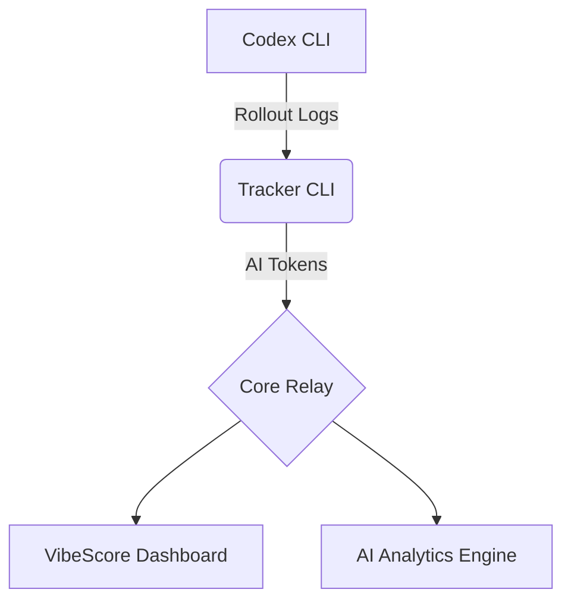

<div align="center">

# 🟢 VIBESCORE

**量化你的 AI 产出**  
_Codex CLI 实时 AI 分析工具_

[**www.vibescore.space**](https://www.vibescore.space)

[](https://opensource.org/licenses/MIT)
[](https://nodejs.org/)
[](https://www.apple.com/macos/)

[**English**](README.md) • [**中文说明**](README.zh-CN.md)

[**文档**](docs/) • [**控制台**](dashboard/) • [**后端接口**](BACKEND_API.md)

</div>

---

## 🌌 项目概述

**VibeScore** 是一个专为 macOS 开发者设计的智能令牌（Token）使用追踪系统。它能够实时监控 Codex CLI 的输出，通过高度可视化的 **Matrix** 风格仪表盘，将你的 **AI 产出 (AI Output)** 转化为可量化的指标。

> [!TIP] > **Core Index (核心指数)**: 我们的标志性指标，通过分析 Token 消耗速率与模式，反映你的开发心流状态。

## 🔒 隐私优先架构 (隐身协议)

我们坚信你的代码和思想属于你自己。VibeScore 建立在严格的隐私支柱之上，确保你的数据始终处于受控状态。

- 🛡️ **代码零入侵**：我们绝不触碰你的源代码或 Prompt。我们的嗅探器仅提取数值化的 Token 计数（输入、输出、推理、缓存）。
- 📡 **本地聚合**：所有 Token 消耗分析均在你的机器上完成。我们仅将量化的 30 分钟使用桶（Usage Buckets）中继到云端。
- 🔐 **身份哈希**：设备令牌在服务端使用 SHA-256 进行哈希处理。你的原始凭据绝不会存在于我们的数据库中。
- 🔦 **全程透明**：你可以亲自审计 `src/lib/rollout.js` 中的同步逻辑。我们真正采集的只有数字和时间戳。

## 🚀 核心功能

- 📡 **Live Sniffer (实时嗅探)**: 实时监听 Codex CLI 管道，通过底层 Hook 捕获每一次补全事件。
- 🧭 **多来源采集**：支持 Codex CLI 与 Every Code（标记为 `source=every-code`），无需修改 Every Code 客户端。
- 📊 **Matrix Dashboard (矩阵控制台)**: 基于 React + Vite 的高性能仪表盘，具备热力图、趋势图与实时日志。
- ⚡ **AI Analytics (AI 分析)**: 深度分析 Input/Output Token，支持缓存 (Cached) 与推理 (Reasoning) 部分的分离监控。
- 🔒 **Identity Core (身份核心)**: 完备的身份验证与权限管理，保护你的开发数据资产。

## 🛠️ 快速开始

### 安装

只需一行命令，即可初始化环境：

```bash
npx --yes @vibescore/tracker init
```

### 同步与状态查看

```bash
# 同步最新的本地会话数据
npx --yes @vibescore/tracker sync

# 查看当前连接状态
npx --yes @vibescore/tracker status
```

### 日志来源

- Codex CLI 日志：`~/.codex/sessions/**/rollout-*.jsonl`（可用 `CODEX_HOME` 覆盖）
- Every Code 日志：`~/.code/sessions/**/rollout-*.jsonl`（可用 `CODE_HOME` 覆盖）

## 🧰 常见问题

### Streak 显示 0 天但总量正常

- Streak 的口径是“从今天开始连续使用的天数”，如果今天的 total 为 0，streak 就是 0。
- 如果你确认应该有 streak，请清理本地缓存并重新登录：

```js
localStorage.removeItem("vibescore.dashboard.auth.v1");
Object.keys(localStorage)
  .filter((k) => k.startsWith("vibescore.heatmap."))
  .forEach((k) => localStorage.removeItem(k));
location.reload();
```

- 刷新后重新走一遍 landing page 的登录流程。
- 说明：Dashboard 不使用 `insforge-auth-token`，实际存储在 `vibescore.dashboard.auth.v1`。

## 🏗️ 系统架构



## 💻 开发者指南

如果你想在本地运行或贡献代码：

### 仪表盘开发

```bash
# 安装依赖
cd dashboard
npm install

# 启动开发服务器
npm run dev
```

### 整体架构验证

```bash
# 验证 Copy 注册表
npm run validate:copy

# 执行烟雾测试
npm run smoke
```

## 📜 开源协议

本项目基于 [MIT](LICENSE) 协议开源。

---

<div align="center">
  <b>System_Ready // 2024 VibeScore OS</b><br/>
  <i>"More Tokens. More Vibe."</i>
</div>
