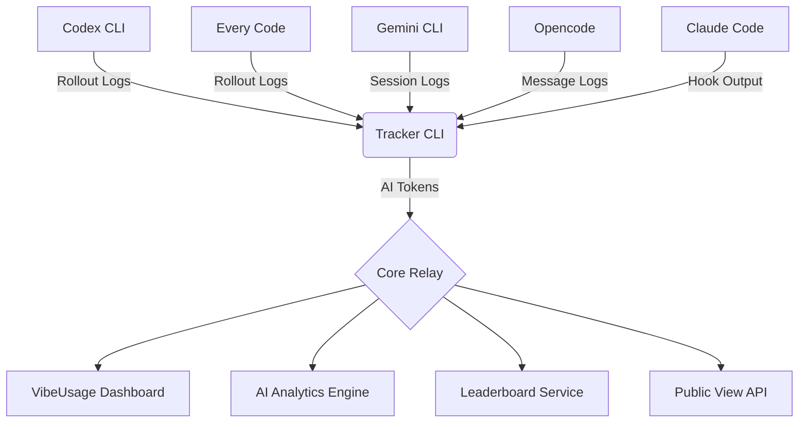

<div align="center">


# 🟢 VIBEUSAGE

**量化你的 AI 产出**  
_Codex CLI 实时 AI 分析工具_

[**www.vibeusage.cc**](https://www.vibeusage.cc)

[](https://opensource.org/licenses/MIT)
[](https://nodejs.org/)
[](https://www.apple.com/macos/)

[**English**](README.md) • [**中文说明**](README.zh-CN.md)

[**文档**](docs/) • [**控制台**](dashboard/) • [**后端接口**](BACKEND_API.md)

<br/>


</div>

---

## 🌌 项目概述

**VibeUsage** 是一个专为 macOS 开发者设计的智能令牌（Token）使用追踪系统。它通过全新的 **Matrix-A Design System**，提供高度可视化的赛博朋克风格仪表盘，将你的 **AI 产出 (AI Output)** 转化为可量化的指标，并支持通过 **Neural Divergence Map** 实时监控多模型的算力分布。

> [!TIP] > **Core Index (核心指数)**: 我们的标志性指标，通过分析 Token 消耗速率与模式，反映你的开发心流状态。

## 🔒 隐私优先架构 (隐身协议)

我们坚信你的代码和思想属于你自己。VibeUsage 建立在严格的隐私支柱之上，确保你的数据始终处于受控状态。

- 🛡️ **内容不出本地**：我们从不上传 Prompt 或响应内容。只在本地计算 Token 数量，并上传 Token 计数与最小元数据（时间、模型、设备）。
- 📡 **本地聚合**：所有 Token 消耗分析均在你的机器上完成。我们仅将量化的 30 分钟使用桶（Usage Buckets）中继到云端。
- 🔐 **身份哈希**：设备令牌在服务端使用 SHA-256 进行哈希处理。你的原始凭据绝不会存在于我们的数据库中。
- 🔦 **全程透明**：你可以亲自审计 `src/lib/rollout.js` 中的同步逻辑。我们真正采集的只有数字和时间戳。

## 🚀 核心功能

- 📡 **自动嗅探与同步 (Auto-Sync)**: 实时监听 AI CLI 管道并具备**全自动后台同步**功能。初始化后，你的 Token 产出将自动追踪并同步，无需手动执行脚本。
- 🧭 **全能采集 (Universal-Sync)**: 原生支持多种 AI CLI 工具：
  - **Codex CLI** - OpenAI 官方 CLI
  - **Every Code** - 社区版 Codex 替代品
  - **Gemini CLI** - Google AI CLI
  - **Opencode** - AI 编程助手
  - **Claude Code** - Anthropic 官方 CLI
  - 无论是 GPT-4、Claude 3.5 Sonnet 还是 o1/Gemini，所有模型的 Token 消耗均可被统一捕获与统计。
- 📊 **Matrix Dashboard (矩阵控制台)**: 基于 React + Vite 的高性能仪表盘，采用全新的 **Matrix-A** 设计语言。
  - **Neural Divergence Map (神经发散图谱)**: 可视化多引擎负载均衡状态，直观展示算力分布。
  - **Cost Intelligence (成本智能)**: 实时、多维度的成本分解与预测。
  - **Activity Heatmap (活跃热力图)**: GitHub 风格的贡献图，支持连续天数统计。
  - **Smart Notifications (智能通知)**: 非侵入式的系统级通知，采用金色 (Gold/Amber) 视觉传达高价值信息。
- ⚡ **AI Analytics (AI 分析)**: 深度分析 Input/Output Token，支持缓存 (Cached) 与推理 (Reasoning) 部分的分离监控。
- 📈 **排行榜 (Leaderboard)**: 日、周、月、总排行榜，使用隐私安全的显示名称。
- 🌐 **公开视图 (Public View)**: 分享你的 AI 使用历程，隐私安全的公开档案。
- 📁 **项目统计 (Project Stats)**: 按项目/仓库追踪 Token 使用，支持全时间范围。
- 🔒 **Identity Core (身份核心)**: 完备的身份验证与权限管理，保护你的开发数据资产。

### 🌌 视觉预览


## 🛠️ 快速开始

### 安装

只需一次初始化，即可变身为“自动驾驶”模式。VibeUsage 会在后台处理所有数据同步，你只需专注开发。

```bash
npx --yes vibeusage init
```

**认证方式：**

1. **浏览器认证**（默认）- 打开浏览器进行安全认证
2. **链接码** - 使用 `--link-code` 通过控制台生成的代码认证
3. **密码** - 直接密码认证（后备方案）
4. **访问令牌** - 用于 CI/自动化环境

**CLI 选项：**
- `--yes` - 非交互环境跳过确认提示
- `--dry-run` - 仅预览变更，不写入文件
- `--link-code <code>` - 使用控制台的链接码认证
- `--base-url <url>` - 覆盖默认 API 端点

**支持的 CLI 工具自动配置：**

| 工具 | 配置位置 | 方式 |
|------|---------|------|
| Codex CLI | `~/.codex/config.toml` | `notify` hook |
| Every Code | `~/.code/config.toml`（或 `CODE_HOME`） | `notify` hook |
| Gemini CLI | `~/.gemini/settings.json`（或 `GEMINI_HOME`） | `SessionEnd` hook |
| Opencode | 全局插件 | 消息解析插件 |
| Claude Code | `~/.claude/hooks/` | Hook 配置 |

`init` 完成后，所有支持的 CLI 工具将自动配置数据同步，无需额外操作。

### 同步与状态查看

虽然同步是自动完成的，但你仍可以随时手动触发同步或查看状态：

```bash
# 手动同步最新的本地会话数据 (可选)
npx --yes vibeusage sync

# 查看当前连接状态
npx --yes vibeusage status
```

### Doctor

```bash
# 运行健康检查
npx --yes vibeusage doctor

# 输出 JSON 报告（同时写文件）
npx --yes vibeusage doctor --json --out doctor.json

# 覆盖 base URL（仅诊断）
npx --yes vibeusage doctor --base-url https://example.invalid
```

### 卸载

```bash
# 标准卸载（保留数据）
npx --yes vibeusage uninstall

# 完全清理 - 删除所有数据，包括配置和缓存会话
npx --yes vibeusage uninstall --purge
```

### 日志来源

| 工具 | 日志位置 | 覆盖环境变量 |
|------|---------|-------------|
| Codex CLI | `~/.codex/sessions/**/rollout-*.jsonl` | `CODEX_HOME` |
| Every Code | `~/.code/sessions/**/rollout-*.jsonl` | `CODE_HOME` |
| Gemini CLI | `~/.gemini/tmp/**/chats/session-*.json` | `GEMINI_HOME` |
| Opencode | `~/.opencode/messages/*.json` | - |
| Claude Code | 从 hook 输出解析 | - |

## 🔧 环境变量

### 核心设置

| 变量 | 说明 | 默认值 |
|------|------|--------|
| `VIBEUSAGE_HTTP_TIMEOUT_MS` | CLI HTTP 超时（毫秒，`0` 表示关闭，范围 `1000..120000`） | `20000` |
| `VITE_VIBEUSAGE_HTTP_TIMEOUT_MS` | Dashboard 请求超时（毫秒，`0` 表示关闭，范围 `1000..30000`） | `15000` |
| `VIBEUSAGE_DEBUG` | 启用调试输出（`1` 或 `true` 开启） | - |
| `VIBEUSAGE_DASHBOARD_URL` | 自定义 Dashboard URL | `https://www.vibeusage.cc` |
| `VIBEUSAGE_INSFORGE_BASE_URL` | 自定义 API 基础 URL | `https://5tmappuk.us-east.insforge.app` |
| `VIBEUSAGE_DEVICE_TOKEN` | 预配置设备令牌（用于 CI） | - |

### CLI 工具覆盖

| 变量 | 说明 | 默认值 |
|------|------|--------|
| `CODEX_HOME` | Codex CLI 目录覆盖 | `~/.codex` |
| `CODE_HOME` | Every Code 目录覆盖 | `~/.code` |
| `GEMINI_HOME` | Gemini CLI 目录覆盖 | `~/.gemini` |

### 已废弃

- `VIBEUSAGE_ROLLUP_ENABLED`：当前被忽略；rollup 聚合在代码层禁用，等待 rollup 表部署完成后再恢复。

## 🧰 常见问题

### 调试模式

启用调试输出以查看详细的请求/响应信息：

```bash
VIBEUSAGE_DEBUG=1 npx --yes vibeusage sync
# 或
npx --yes vibeusage sync --debug
```

### 健康检查

运行内置的 doctor 命令诊断问题：

```bash
# 基础健康检查
npx --yes vibeusage doctor

# JSON 输出用于调试
npx --yes vibeusage doctor --json --out doctor.json

# 测试不同端点
npx --yes vibeusage doctor --base-url https://your-instance.insforge.app
```

### Streak 显示 0 天但总量正常

- Streak 的口径是“从今天开始连续使用的天数”，如果今天的 total 为 0，streak 就是 0。
- 如果你确认应该有 streak，请清理本地缓存并重新登录：

```js
localStorage.removeItem("vibeusage.dashboard.auth.v1");
Object.keys(localStorage)
  .filter((k) => k.startsWith("vibeusage.heatmap."))
  .forEach((k) => localStorage.removeItem(k));
location.reload();
```

- 刷新后重新走一遍 landing page 的登录流程。
- 说明：Dashboard 不使用 `insforge-auth-token`，实际存储在 `vibeusage.dashboard.auth.v1`。

### 同步问题

如果数据未出现在控制台：

1. 检查状态：`npx --yes vibeusage status`
2. 强制手动同步：`npx --yes vibeusage sync`
3. 验证 CLI 工具 hooks 是否已配置（需要时重新运行 `init`）
4. 检查调试输出：`VIBEUSAGE_DEBUG=1 npx vibeusage sync`

### 超时错误

为慢速连接增加 HTTP 超时：

```bash
VIBEUSAGE_HTTP_TIMEOUT_MS=60000 npx --yes vibeusage sync
```

## 🏗️ 系统架构



### 组件说明

- **Tracker CLI** (`src/`): Node.js CLI，解析多个 AI 工具的日志并同步 Token 数据
- **Core Relay** (InsForge Edge Functions): 无服务器后端，处理摄取、聚合和 API
- **Dashboard** (`dashboard/`): React + Vite 前端可视化
- **AI Analytics Engine**: 成本计算、模型分解和使用预测

## 💻 开发者指南

如果你想在本地运行或贡献代码：

### 仪表盘开发

```bash
# 安装依赖
cd dashboard
npm install

# 启动开发服务器
npm run dev
```

### 调试字段（Usage 接口）

当请求包含 `debug=1` 时，usage 接口会在响应体中附带 `debug` 对象，方便前端定位慢查询而不依赖响应头。

```ts
const res = await fetch(
  `${baseUrl}/functions/vibeusage-usage-summary?from=2025-12-30&to=2025-12-30&debug=1`,
  {
    headers: { Authorization: `Bearer ${userJwt}` }
  }
);
const data = await res.json();

if (data.debug) {
  console.debug('usage debug', {
    requestId: data.debug.request_id,
    status: data.debug.status,
    queryMs: data.debug.query_ms,
    slowThresholdMs: data.debug.slow_threshold_ms,
    slowQuery: data.debug.slow_query
  });
}
```

### 整体架构验证

```bash
# 验证 Copy 注册表
npm run validate:copy

# 执行烟雾测试
npm run smoke
```

### 架构画布聚焦

```bash
# 生成指定顶层模块的聚焦画布
node scripts/ops/architecture-canvas.cjs --focus src

# 别名：--module
node scripts/ops/architecture-canvas.cjs --module dashboard
```

## 📜 开源协议

本项目基于 [MIT](LICENSE) 协议开源。

---

<div align="center">
  <b>System_Ready // 2024 VibeUsage OS</b><br/>
  <i>"More Tokens. More Vibe."</i>
</div>
